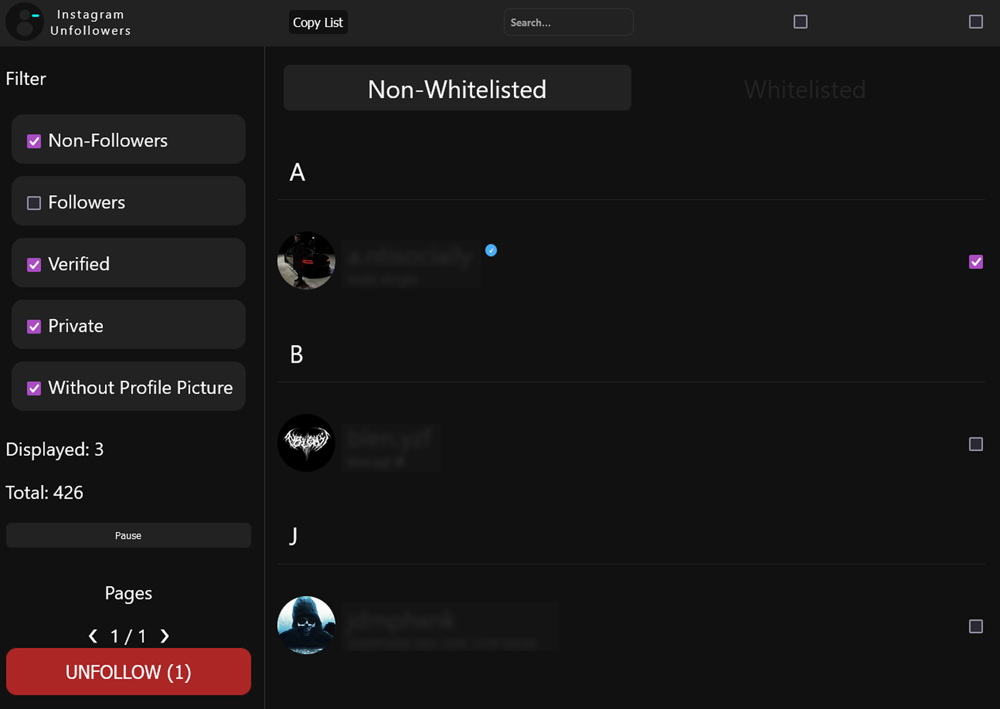
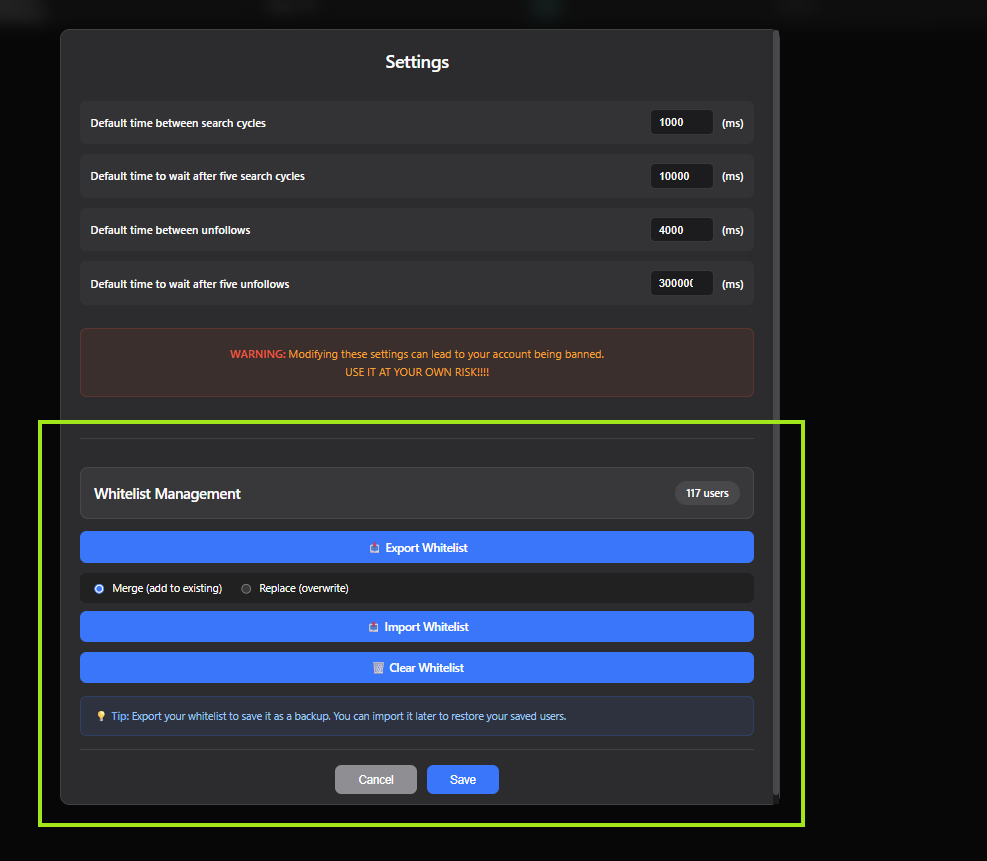
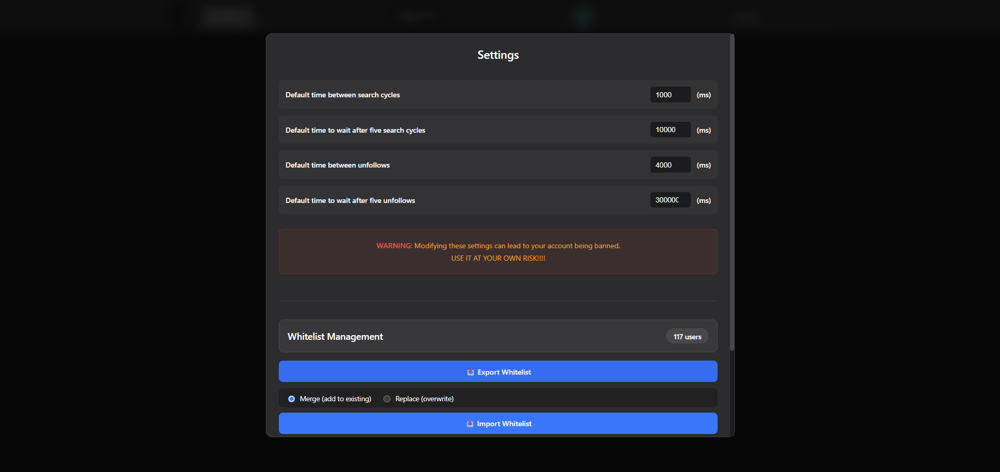

# 📱 Instagram Unfollowers

A nifty tool that lets you see who doesn't follow you back on Instagram.  
<u>Browser-based and requires no downloads or installations!</u>

## ⚠️ WARNING

This version utilizes the Instagram API for better performance.  

## 🖥️ Desktop Usage

**Where to get the code:**
- The JavaScript code is available in this repository's `dist/bundle.js` file: [dist/bundle.js](https://github.com/ReWelp/InstagramUnfollowRatio/blob/main/dist/bundle.js)

**Steps to run:**
1. Go to Instagram website and log in to your account

2. Open the developer console:
   - **Chrome/Edge**: `Ctrl + Shift + J` (Windows) or `⌘ + ⌥ + J` (Mac)
   - **Firefox**: `Ctrl + Shift + K` (Windows) or `⌘ + ⌥ + K` (Mac)
   - **Safari**: Enable Developer Tools in Preferences, then `⌘ + ⌥ + C`

3. Copy the entire JavaScript code snippet (starts with `(()=>{"use strict"`)

4. Paste the code into the console and press `Enter`

5. The Instagram Unfollowers interface will appear directly on the page

    

6. Click "RUN" to start scanning

7. After scanning completes, you'll see the results:

    

8. 🤍 Whitelist users by clicking their profile image

9. 💾 Manage your whitelist via Settings:
   - Export: Save your whitelist as a JSON backup file
   - Import: Restore or merge whitelisted users from a file
   - Clear: Remove all users from whitelist
   
   Your whitelist persists between sessions automatically!

    

10. ✅ Select users to unfollow using the checkboxes

11. ⚙️ Customize script timings via the "Settings" button:

    

## 📱 Mobile Usage

For Android users who want to use it on mobile:

1. Download the latest version of [Eruda Android Browser](https://github.com/liriliri/eruda-android/releases/)
2. Open Instagram web through the Eruda browser
3. Follow the same steps as desktop (the console will be automatically available when clicking the eruda icon)

## ⚡ Performance Notes

- Processing time increases with the number of users to check
- Script works on both Chromium and Firefox-based browsers
- The script takes a few more seconds to load on mobile
- Whitelist data is stored locally in your browser (localStorage)

## ✨ Features

- 🔍 Scan and identify users who don't follow you back
- 🤍 Whitelist system to protect specific accounts from unfollowing
- 💾 Export/Import whitelist functionality for backup and transfer
- ⚙️ Customizable timing settings to avoid rate limits
- 🎨 Clean, minimalist interface inspired by Apple design
- 📱 Fully responsive - works on desktop and mobile
- 🔒 All data stored locally - no external servers

## 🛠️ Development

- Node version: 16.14.0 (If using nvm, run `nvm use`)
- After modifying `main.tsx`, run the "build" command to format, compress, and convert your code
- Automatic re-building can be done using nodemon build-dev

## ⚖️ Legal & License

**Disclaimer:** This tool is not affiliated, associated, authorized, endorsed by, or officially connected with Instagram.

⚠️ Use at your own risk!

📜 Licensed under the [MIT License](LICENSE)
- ✅ Free to use, copy, and modify
- 🤝 Open source and community-friendly
- 📋 See [LICENSE](LICENSE) file for full terms
